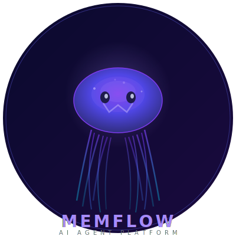

# 🪸 MemFlow

<p align="center">
  
</p>

**Workflow-first AI Agent Platform** — Rust workflow engine + TypeScript agent runtime + multi-channel messaging + self-learning skills.

MemFlow is an open-source AI agent platform that combines a high-performance Rust workflow execution engine with a full-featured agent runtime. It routes tasks through smart LLM providers, executes workflows, learns from experience, and delivers results across 10+ messaging channels.

## Quick Start

```bash
# 1. Install dependencies & build
cd agent-service && npm install && npm run build

# 2. Run the setup wizard (interactive — guides you through everything)
npm run setup

# 3. Service is running at http://localhost:3000
#    Try it out:
curl http://localhost:3000/health
curl http://localhost:3000/skills
```

The setup wizard will:
- Check prerequisites (Node.js, Docker)
- Ask for your LLM provider API keys (OpenAI, Anthropic, Groq, etc.)
- Auto-detect any existing `.env` file
- Optionally configure messaging channels (Telegram, Discord, Slack)
- Start the service
- Verify everything works

> **Like `openclaw onboard` or `hermes setup`** — but for MemFlow.

### Manual start (if you prefer)

```bash
cd agent-service
npm start
# Service runs on http://localhost:3000
```

## Architecture

```
┌─────────────┐     ┌──────────────┐     ┌─────────────┐
│  Channels   │────▶│ Agent Service│────▶│  Executor   │
│ (Telegram,  │     │ (Node.js)    │     │ (Rust)      │
│  Discord,   │     │              │     │             │
│  Slack...)  │     │ • LLM Router │     │ • Workflow  │
└─────────────┘     │ • Curator    │     │ • Sandbox   │
                    │ • Skills     │     │ • WASM      │
┌─────────────┐     │ • MCP        │     │ • Subagents │
│   Web UI    │────▶│ • Middleware │     └──────┬──────┘
│  (React)    │     │ • Checkpoints│            │
└─────────────┘     └──────┬───────┘            │
                           │                    │
                    ┌──────▼────────────────────▼──┐
                    │       Memory Hub (Rust)       │
                    │  Persistent storage + search  │
                    └───────────────────────────────┘
```

## Features

### Core Runtime
| Feature | Description |
|---------|-------------|
| **Smart LLM Routing** | Auto-selects provider/model by task complexity (4 tiers, 14 providers: OpenAI, Anthropic, Groq, DeepSeek, Gemini, etc.) |
| **Provider Fallback** | Primary → secondary → tertiary fallback with cost tracking |
| **Think-Act-Observe Loop** | Multi-iteration agent loop with tool calling, error recovery, and context compression |
| **Streaming** | Real-time response streaming via SSE (OpenAI + Anthropic) |
| **MCP Support** | Full MCP server + client (stdio/SSE), tool discovery, auto-connect |

### Self-Learning
| Feature | Description |
|---------|-------------|
| **Curator** | Monitors executions, auto-generates skills from patterns, merges similar skills, prunes unused ones |
| **Skill System** | SKILL.md compatible (Superpowers/agentskills.io format), 26 built-in skills |
| **Marketplace** | Browse and install skills from GitHub repos |
| **Memory** | Persistent memory with semantic search via memory hub |

### Reliability
| Feature | Description |
|---------|-------------|
| **Checkpoints** | Session state persistence with auto-resume after restart, 1GB pruning |
| **Middleware Pipeline** | 6 pluggable layers: sandbox, summarization, todo, memory, title, clarification |
| **Health Probes** | /health, /ready (with dependency checks), /live endpoints |
| **Graceful Shutdown** | SIGTERM/SIGINT → disconnect MCP → flush checkpoints → clean exit |
| **Retry Backoff** | Automatic retry with exponential backoff for service calls |
| **Backup/Restore** | One-click state snapshots |

### Security
| Feature | Description |
|---------|-------------|
| **Authentication** | JWT + API key auth, enabled by default, public endpoint whitelist |
| **Rate Limiting** | Token bucket per IP (default 100 req/min) |
| **CORS** | Configurable origin allowlist |
| **Encryption at Rest** | AES-256-GCM for provider API keys and secrets |
| **Input Validation** | Request body validation on all critical endpoints |
| **Security Scanner** | 5-category scan: secrets, permissions, hooks, MCP, config |

### Channels
| Platform | Status |
|----------|:------:|
| Telegram | ✅ |
| Discord | ✅ |
| Slack | ✅ |
| WhatsApp | ✅ |
| Signal | ✅ |
| WeChat | ✅ |
| Feishu / Lark | ✅ |
| Microsoft Teams | ✅ |
| Google Chat | ✅ |
| LINE | ✅ |

### Observability
| Feature | Description |
|---------|-------------|
| **Structured Logging** | JSON via pino, configurable log level |
| **Prometheus Metrics** | Request counts, agent duration histogram, active sessions, MCP connections |
| **Tracing** | Per-session trace spans (/traces endpoint) |
| **Cost Tracking** | Per-provider token usage and cost |

### SDK
```
npm install @memflow/sdk
```

```typescript
import { MemFlow } from "@memflow/sdk";
const mf = new MemFlow({ baseUrl: "http://localhost:3000" });

// Execute agent
const result = await mf.agent.execute("analyze this log file");

// Manage providers
await mf.providers.add("groq", { apiKey: "gsk_..." });

// Run curator
await mf.curator.run();

// Save checkpoint
await mf.checkpoints.save("session-1", [...messages]);
```

## Deployment

### Docker Compose (recommended)
```bash
docker compose up -d
```

### Manual (development)
```powershell
# Executor
cargo run -p executor -- serve --addr 127.0.0.1:8082

# Memory Hub
cargo run -p memory-hub

# Agent Service
cd agent-service && npm install && npm run build
$env:PORT=3000; node dist/index.js
```

### Configuration
| Env Var | Default | Description |
|---------|---------|-------------|
| `PORT` | 3000 | Agent service port |
| `EXECUTOR_URL` | http://127.0.0.1:8082 | Executor URL |
| `MEMORY_HUB_URL` | http://127.0.0.1:8081 | Memory hub URL |
| `EXECUTOR_API_KEY` | memflow-local-dev-key | Shared API key |
| `AUTH_ENABLED` | true | Enable authentication |
| `API_KEYS` | — | Comma-separated API keys |
| `RATE_LIMIT_RPM` | 100 | Rate limit per IP |
| `CORS_ORIGIN` | http://localhost:3000 | Allowed CORS origin |
| `ENCRYPTION_KEY` | — | AES-256-GCM key for secrets |
| `LOG_LEVEL` | info | Log level (trace/debug/info/warn/error) |
| `MEMFLOW_RUNTIME_ROOT` | ./.memflow-runtime | Runtime data directory |

## API Overview

| Category | Endpoints |
|----------|-----------|
| Agent | `POST /agent/execute`, `POST /v1/chat/completions` |
| Router | `GET /router/config`, `POST /router/config`, `GET /router/stats` |
| MCP | `GET/POST/DELETE /mcp/servers`, `POST .../connect`, `POST .../disconnect` |
| Curator | `POST /curator/run`, `GET /curator/status`, `GET /curator/history` |
| Checkpoints | `GET /checkpoints`, `POST /checkpoints/save`, `GET .../latest`, `DELETE .../:id` |
| Skills | `GET /skills`, `POST /skills/import`, `GET /marketplace/list` |
| Middleware | `GET /middleware/config`, `POST .../:name/toggle` |
| Providers | `GET/POST /providers`, `DELETE /providers/:id` |
| Channels | `GET/POST /channels`, `DELETE /channels/:id` |
| Tracing | `GET /traces`, `GET /traces/:sessionId` |
| Security | `POST /security/scan` |
| Sandbox | `GET/POST /sandbox/config`, `POST /sandbox/execute` |
| Subagents | `GET /subagents`, `POST .../spawn`, `GET .../:id/status`, `POST .../:id/cancel` |
| Goal | `POST /goal/set`, `GET /goal`, `POST /goal/complete` |
| Health | `GET /health`, `GET /ready`, `GET /live`, `GET /metrics` |
| Backup | `POST /backup`, `POST /backup/restore` |
| Setup | `GET /setup/status` |

## Testing

```bash
# Unit tests (TypeScript)
cd agent-service && npx vitest run

# Rust tests
cargo test --workspace

# E2E (services must be running)
pwsh test/e2e.ps1
```

## Development

### Prerequisites
- Rust (stable), Node.js 18+, Docker (optional)

### Install dependencies
```bash
cd agent-service && npm install
cd sdk/typescript && npm install
```

### Build
```bash
cd agent-service && npm run build
cd sdk/typescript && npx tsc
cargo build --workspace
```

## License

MIT

## Acknowledgments

Inspired by and compatible with:
- [Superpowers](https://github.com/obra/superpowers) — SKILL.md skill format
- [OpenClaw](https://github.com/openclaw/openclaw) — Multi-channel agent design
- [Hermes Agent](https://github.com/NousResearch/hermes-agent) — Self-learning curator pattern
- [DeerFlow](https://github.com/bytedance/deer-flow) — Middleware chain and context management
- [Everything Claude Code](https://github.com/affaan-m/everything-claude-code) — Agent ecosystem
